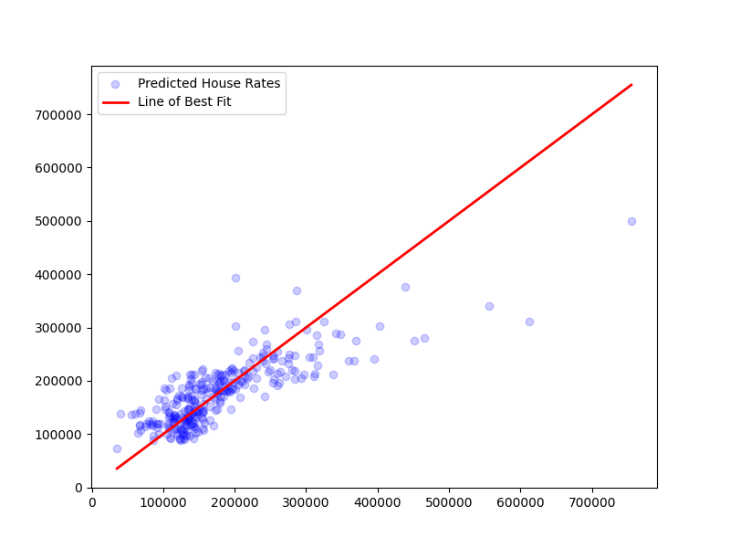

# House Price Prediction using Linear Regression

An end-to-end Machine Learning project developed as part of the **Prodigy InfoTech Data Science Internship (Task 1)**.

This model predicts the price of a house (`SalePrice`), based on the identified key features such as `GrLivArea`, `BedroomAbvGr`and `FullBath`.

---

## 📌 Project Overview .

The aim of this project is to implement a clean data pipeline that loads raw real estate data, filters and renames relevant features, trains a `LinearRegression` model, evaluates its accuracy ($R^2$ and RMSE) against unseen test data, and provides a clear visual evaluation of the model's performance.

---

## 📊 Dataset Dictionary
The model utilizes a targeted subset of features extracted from the raw `train.csv` file from the Official Kaggle Dataset:

| Raw Column Name | Cleaned Name | Data Type | Description |
| :--- | :--- | :--- | :--- |
| **`GrLivArea`** | `SquareFootage` | Continuous | Above grade (ground) living area square feet |
| **`BedroomAbvGr`** | `Bedrooms` | Integer | Bedrooms above grade (excludes basement bedrooms) |
| **`FullBath`** | `Bathrooms` | Integer | Full bathrooms above grade |
| **`SalePrice`** | `SalePrice` *(Target)* | Integer | The property's sale price in dollars ($) |

(Source: [Kaggle Dataset](https://www.kaggle.com/c/house-prices-advanced-regression-techniques/data?select=train.csv)
)

---

## 🛠️ Tech Stack & Dependencies
This project is written natively in Python 3 and relies on standard data science libraries:
* **Pandas:** For data ingestion, manipulation, and structural column renaming.
* **NumPy:** For high-performance mathematical operations (calculating the Root Mean Squared Error).
* **Scikit-Learn:** For data splitting (`train_test_split`), building the machine learning model (`LinearRegression`), and performance scoring.
* **Matplotlib:** For rendering the visual performance diagnostic chart.

---

## 🏗️ Model Architecture & Logic

### 1. The Mathematical Formula
Under the hood, the model computes the relationship between the features and house prices using the following multi-variable linear equation:

$$\text{SalePrice} = \beta_0 + (\beta_1 \times \text{SquareFootage}) + (\beta_2 \times \text{Bedrooms}) + (\beta_3 \times \text{Bathrooms})$$

Where:
* $\beta_0$ represents the **Intercept** (baseline property/land cost).
* $\beta_1, \beta_2, \beta_3$ represent the learned **Coefficients (Feature Weights)**.

### 2. The Train-Test Split
To prevent overfitting and test real-world generalization, the dataset of 1,460 properties is randomly split into:
* **80% Training Data:** Used by the algorithm to discover mathematical weights.
* **20% Evaluation Testing Data:** Held back completely to act as a blind validation set.

---

## 📈 Performance & Evaluation Metrics

Upon running the script, the model evaluates its predictions on the test set utilizing two key industry standards:

* **RMSE (Root Mean Squared Error):** Quantifies the average distance between the model's predictions and the actual sale prices. 
* **$R^2$ (Coefficient of Determination):** Represents the percentage of variance in house prices that our chosen features can successfully explain.

### Visualizing Results
The script outputs an **Actual vs. Predicted Price Plot**. 
* **Blue Dots (`alpha=0.2`):** Represent individual test houses. The transparency reveals high-density clusters where points overlap.
* **Red Line ($X = Y$):** Represents the **Line of Perfect Fit**. The closer the blue dots cluster around this line, the more accurate the model is.



---

## 🚀 How To Run the Project

1. **Clone the repository or save your files locally:**
   Make sure your script (`main.py`) and the dataset (`train.csv`) are stored in the same project directory.

2. **Install the required packages via your terminal:**
   ```bash
   pip install pandas numpy matplotlib scikit-learn

---
